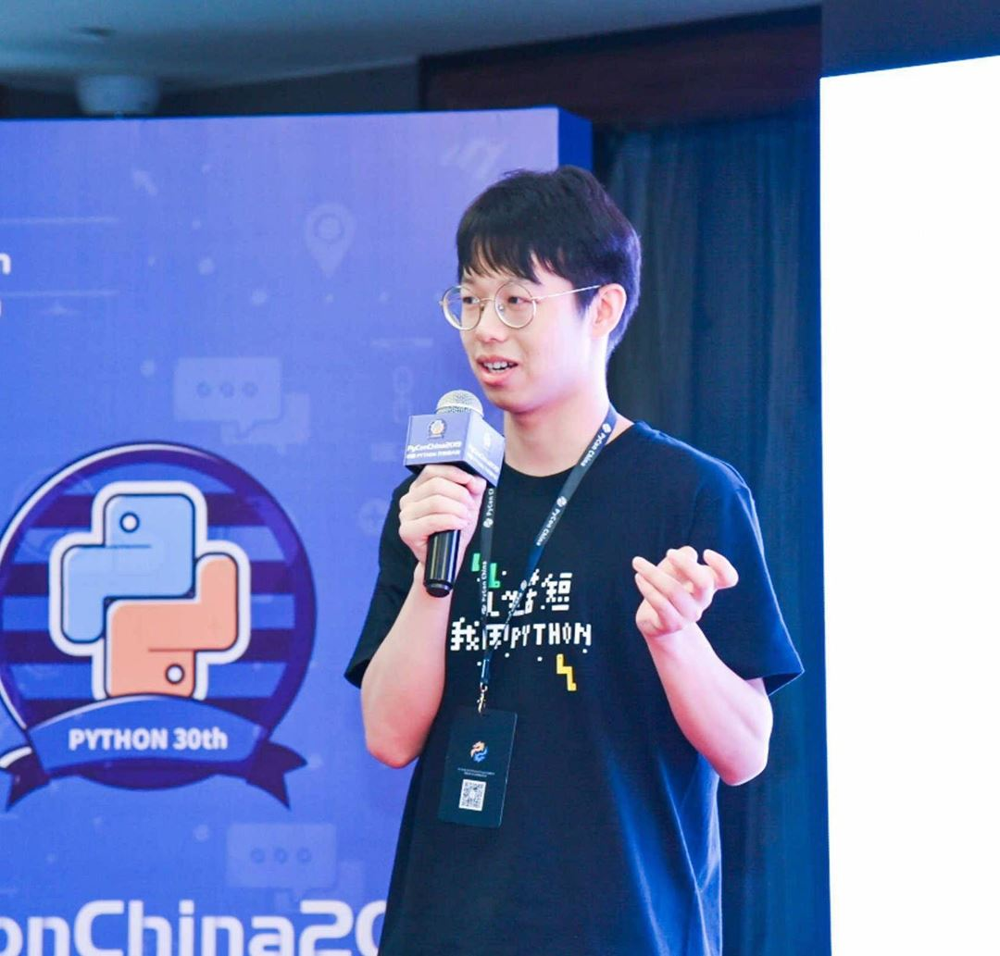

> Series community virtual events
>
> Diving Into Python Machine Learning Algorithms

# Python 机器学习算法实践系列活动

👆点击上方按钮，部署该仓库到 [Azure Notebooks](https://cda.ms/1gf) 环境运行Jupyter脚本，全线上编写Python机器学习代码。🆓

> The Azure Notebooks preview is ending and the site is retiring on September 29th, 2020. 
>
> 参考迁移指南：<https://notebooks.azure.com/Content/alternatives.html>

该系列活动由**Python社区大咖**+**微软Reactor**+**微软DevRel**联合推出。

## 活动简介

### [什么是机器学习](https://azure.microsoft.com/overview/what-is-machine-learning-platform/?WT.mc_id=mlalg_python-vevent-xinglzhu)？它是如何工作的？

机器学习 (ML) 是在不提供直接指令的情况下，使用数据的数学模型来帮助计算机学习的过程。它被视为人工智能 (AI) 的子集。机器学习使用算法来识别数据中的模式，然后使用这些模式创建一个可以进行预测的数据模型。随着数据和经验的增加，机器学习的结果会更加准确，这与人类通过不断练习来提高能力的过程非常相似。

机器学习的适应性使其非常适合数据持续变化、请求或任务的性质不断改变，或无法通过编码来实现解决方案的情况。

### 机器学习算法是什么？
算法是机器学习背后的数学和逻辑，机器学习算法是一些代码片段，可帮助人们探索和分析复杂数据集并在其中找到意义。每个算法是一组有限的明确分步说明，计算机可以遵循这些说明来实现特定目标。在机器学习模型中，目标是建立或发现可用于预测或信息分类的模式。

机器学习算法使用基于训练数据（代表较大数据集的数据子集）的参数。训练数据越大，越能代表真实情况，从而算法计算出的结果也越准确。不同的算法以不同的方式分析数据。算法通常按使用的机器学习技术（监督式学习、非监督式学习和强化学习）进行分类。最常用的算法使用回归和分类预测目标类别、查找异常数据点、预测值和发现相似性。

### 活动计划

| #    | 日期    | 主题                         | 视频                                                        | 代码                                           |
| ---- | ------- | ---------------------------- | ----------------------------------------------------------- | ---------------------------------------------- |
| 1    | 3月21日 | 朴素贝叶斯 Naive Bayes       | [BV1Z741117vy](https://www.bilibili.com/video/BV1Z741117vy) | [01-NaiveBayes](01-NaiveBayes)                 |
| 2    | 4月29日 | 决策树 Decision Tree         | [BV1pz411q7nF](https://www.bilibili.com/video/BV1pz411q7nF) | [02-DecisionTree](02-DecisionTree)             |
| 3    | 5月12日 | 随机森林 Random Forest       | [BV1ra4y1e7tZ](https://www.bilibili.com/video/BV1ra4y1e7tZ) | [03-RandomForest](03-RandomForest)             |
| 4    | 5月27日 | 逻辑回归 Logistic Regression | [BV1yV411r7Nj](https://www.bilibili.com/video/BV1yV411r7Nj) | [04-LogisticRegression](04-LogisticRegression) |
| 5    | 6月24日 | K-邻近 KNN                   | WIP                                                         | [05-KNN](05-KNN)                               |
| 6    | 7月8日  | DBSCAN                       | WIP                                                         | [06-DBSCAN](06-DBSCAN)                         |
| 7    | 7月24日 | K-Means                      |                                                             |                                                |

---

### 讲师

王大伟

平安金融壹账通

大数据研究院数据挖掘工程师，60w粉丝的Python爱好者社区公众号负责人。

主要研究方向：自然语言处理。

### 主办方

微软开发者关系团队帮助地球上每一个开发人员成就更多，无论你是学生还是在企业或初创公司。我们的全球团队热衷于让所有开发者为这世界惊叹，我们很高兴为开源平台，工具和流程提供支持并作出贡献。作为开发人员的倡导者，我们通过宣传、演讲、写作、视频和社区活动与开发人员建立联系。欢迎访问我们网站：<https://developeradvocates.microsoft.com/>

微软 Reactor 上海 是微软为构建开发者社区而提供的一个社区空间，以“予力多元化社区建设，帮助每一个开发者成就不凡”为使命，旨在通过不定期举办的技术讲座、开发者交流会面及技术沙龙和专题活动，帮助开发者和初创企业了解最新技术、学习最新知识、体验最新方案、结识业界同行、扩展职场人脉。Reactor 为开源开发者社区提供免费的活动场地，欢迎点击申请：<https://aka.ms/ReactorShanghai>

## Code of Conduct

Microsoft is dedicated to empowering every person and every organization on the planet to achieve more. **This includes Microsoft Reactor sites where we seek to provide a respectful, friendly, professional experience for everyone, regardless of gender, sexual orientation, physical appearance, disability, age, race or religion.** We do not tolerate any behavior that is harassing or degrading to any individual, in any form. Individuals are responsible for knowing and abiding by these standards. We encourage everyone to assist in creating a welcoming and safe environment.

Please report any concerns, suspicious or disruptive activity or behavior via the [Microsoft Runs on Trust](https://www.microsoft.com/en-us/legal/compliance/integrity) website.

Microsoft reserves the right to refuse admittance to or remove any person from a Reactor site at any time at its discretion.